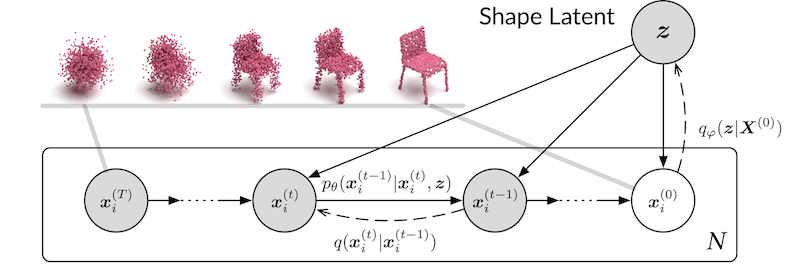

# Diffusion Probabilistic Models for 3D Point Cloud Generation


[[Paper](https://arxiv.org/abs/2103.01458)] [[Code](https://github.com/luost26/diffusion-point-cloud)] [[Demo](https://huggingface.co/spaces/SerdarHelli/diffusion-point-cloud) Created by [SerdarHELLI](https://github.com/SerdarHelli)]

The official code repository for our CVPR 2021 paper "Diffusion Probabilistic Models for 3D Point Cloud Generation".

## Installation

**[Option 1]** Install via conda environment YAML file (**CUDA 10.1**).

```bash
# Create the environment
conda env create -f env.yml
# Activate the environment
conda activate dpm-pc-gen
```

**[Option 2]** Or you may setup the environment manually (**If you are using GPUs that only work with CUDA 11 or greater**).

Our model only depends on the following commonly used packages, all of which can be installed via conda.

| Package      | Version                          |
| ------------ | -------------------------------- |
| PyTorch      | ≥ 1.6.0                          |
| h5py         | *not specified* (we used 4.61.1) |
| tqdm         | *not specified*                  |
| tensorboard  | *not specified* (we used 2.5.0)  |
| numpy        | *not specified* (we used 1.20.2) |
| scipy        | *not specified* (we used 1.6.2)  |
| scikit-learn | *not specified* (we used 0.24.2) |

## About the EMD Metric

We have removed the EMD module due to GPU compatability issues. The legacy code can be found on the `emd-cd` branch.

If you have to compute the EMD score or compare our model with others, we strongly advise you to use your own code to compute the metrics. The generation and decoding results will be saved to the `results` folder after each test run.

## Datasets and Pretrained Models

Datasets and pretrained models are available at: https://drive.google.com/drive/folders/1Su0hCuGFo1AGrNb_VMNnlF7qeQwKjfhZ

## Training

```bash
# Train an auto-encoder
python train_ae.py 

# Train a generator
python train_gen.py
```

You may specify the value of arguments. Please find the available arguments in the script. 

Note that `--categories` can take `all` (use all the categories in the dataset), `airplane`, `chair` (use a single category), or `airplane,chair` (use multiple categories, separated by commas).

### Notes on the Metrics

Note that the metrics computed during the validation stage in the training script (`train_gen.py`, `train_ae.py`) are not comparable to the metrics reported by the test scripts (`test_gen.py`, `test_ae.py`). ***If you train your own models, please evaluate them using the test scripts***. The differences include:
1. The scale of Chamfer distance in the training script is different. In the test script, we renormalize the bounding boxes of all the point clouds before calculating the metrics (Line 100, `test_gen.py`). However, in the validation stage of training, we do not renormalize the point clouds.
2. During the validation stage of training, we only use a subset of the validation set (400 point clouds) to compute the metrics and generates only 400 point clouds (controlled by the `--test_size` parameter). Limiting the number to 400 is for saving time. However, the actual size of the `airplane` validation set is 607, larger than 400. Less point clouds mean that it is less likely to find similar point clouds in the validation set for a generated point cloud. Hence, it would lead to a worse Minimum-Matching-Distance (MMD) score even if we renormalize the shapes during the validation stage in the training script.


## Testing

```bash
# Test an auto-encoder
python test_ae.py --ckpt ./pretrained/AE_all.pt --categories all

# Test a generator
python test_gen.py --ckpt ./pretrained/GEN_airplane.pt --categories airplane
```

## Citation

```
@inproceedings{luo2021diffusion,
  author = {Luo, Shitong and Hu, Wei},
  title = {Diffusion Probabilistic Models for 3D Point Cloud Generation},
  booktitle = {Proceedings of the IEEE/CVF Conference on Computer Vision and Pattern Recognition (CVPR)},
  month = {June},
  year = {2021}
}
```
